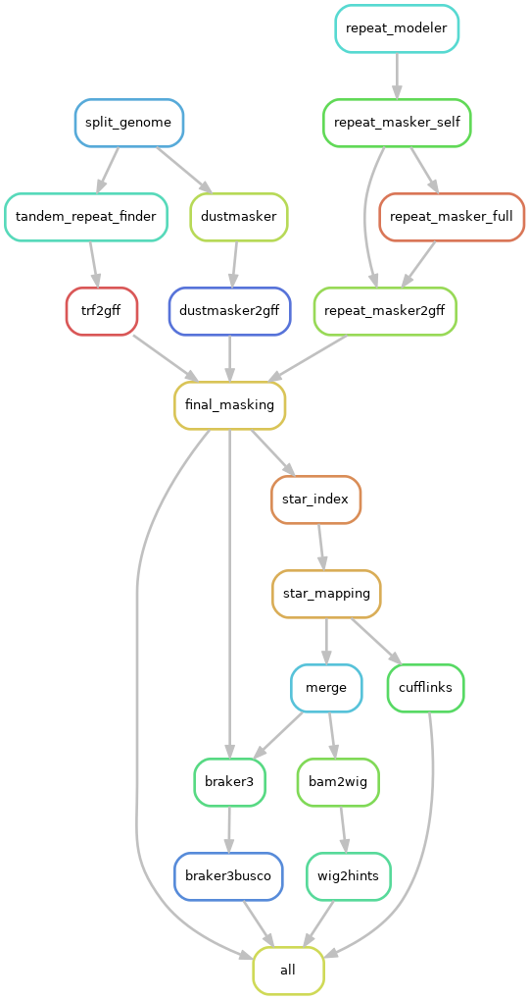
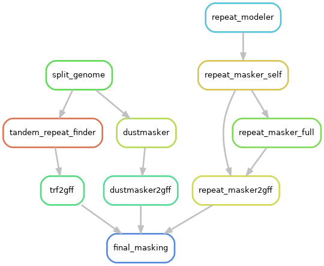

# **Genome Annotation Pipeline**

## **Table of Contents**
- [Input](#input)
- [Dependencies](#dependencies)
- [Testing](#testing)
- [Environment Setup](#environments)
- [Running the Pipeline](#run-pipeline)
- [Pipeline Visualization](#pipeline-visualization)

## Input
- Absolute path to one haplotype at a type from a genome assembly.
- Folder path to RNA seq reads HiC reads should be in two files, {filename}_R1.{fastq|fastq.gz|fq.gz} and {filename}_R2.{fastq|fastq.gz|fq.gz}.

## Dependencies

The following packages need to be set up separately. They can be installed as per the instructions on their respective GitHub pages or in a manner suitable for your system. If your setup differs significantly, you may need to manually adjust the calls to these programs within their respective makefiles found under *'workflow/rules/'*:

In this pipeline we use them with modules which can be changed in the *'config/config.yaml'* file.

- [conda](https://docs.anaconda.com/free/anaconda/reference/release-notes/#anaconda-2022-05-may-10-2022)
- [trf](https://github.com/Benson-Genomics-Lab/TRF)
- [STAR](https://github.com/alexdobin/STAR)
- [AUGUSTUS](http://augustus.gobics.de/)

### BUSCO

For [BUSCO](https://busco.ezlab.org/), it's recommended to use it `offline`. Download your relevant lineage from [here](https://busco-data.ezlab.org/v5/data/lineages/), unpack and place in a folder:

```
curl -O <link>
tar -xf <file> # becomes <folder>
mkdir busco_downloads
mkdir busco_downloads/lineages
mv <folder> busco_downloads/lineages
```

Specify the path in the *'config.yaml'* file.

### RNA-seq and protein sequences for BRAKER3

If you don't have protein sequences, you can download the latest UniProt db using:

```
wget ftp://ftp.uniprot.org/pub/databases/uniprot/current_release/knowledgebase/complete/uniprot_sprot.fasta.gz
gunzip uniprot_sprot.fasta.gz
```

# If you don't have RNA-seq data you can look for them in:
https://trace.ncbi.nlm.nih.gov/Traces/sra/sra.cgi?view=software

and unpack them with:
```
fastq-dump --split-files path/to/YOUR_SRA
```

In case you don't have your own sequencing data, and you need to use either RNA or protein evidence input for BRAKER3 it is advized to curate your own datasets and avoid redundancy in the sequences as much as possible.

## Testing

To test if the pipeline can work in your system, you can download the example data provided by BRAKER3 from [here](https://github.com/Gaius-Augustus/BRAKER/tree/master/example)

Once you do, you can add these files as input in the *'config.yaml'* file like so:

genome:
    file: "path/to/genome.fa"
    haplotype: "hap1"

rnaseq:
    folder: "/share/pool/genofish_and_chips/testannotation/resources/data/rnaseq/"
    type: "Stranded"

prot_db: "/share/pool/genofish_and_chips/testannotation/resources/RefDB/protein_newheader.fa"


### HiC editing
 
This pipeline also includes an optional file for processing HiC reads, *`PROCESS_HIC_READS.smk`*. Test this by subsampling your own HiC paired-end Illumina reads with `seqtk sample` or by using data from a public database.

The purpose of this pipeline is to trim, decontaminate and error correct the HiC files and estimate how much they been improved. The user can then use the version of the HiC reads they prefer.

## Environment(s)

In order to run the pipeline, you need a basic conda environment with python>=3.9 and mamba on your system. 
You can create that with:

```
conda create -y -n genome_assembly "python>=3.9" "mamba>=0.22.1" -c conda-forge -c bioconda -c defaults
conda activate genome_assembly
```

You can then use install the environments used by the different rules of the pipeline in a terminal with an internet connection:

```
#conda activate genome_assembly
snakemake --snakefile PROCESS_HIC_READS.smk --cores 5 -p -r -w 5 --verbose --use-conda  --conda-create-envs-only
```

This can take several minutes and needs to be done every time the environment files are changed.

## Test run:

```
snakemake -s workflow/Snakefile.smk --dry-run --cores 5 -p -r -w 5 --verbose
```

## Run pipeline:
You can then run the pipeline with:

```
snakemake \
    --snakefile workflow/Snakefile.smk \
    --keep-going \
    --latency-wait 300 \
    -j ${THREADS} \
    --use-singularity \
    --singularity-args "--home $PWD" \
    --singularity-args "--bind $PWD/temp:/tmp" \
    --default-resources "tmpdir='/path/to/tmp'" \
    --verbose \
    --use-conda \
    --use-envmodules \
    --printshellcmds \
    --reason \
    --nolock \
    --rerun-triggers mtime \
    --rerun-incomplete \
    --stats "./stats.json" \
    --report "./report.html"
```

## Visualize the steps of the pipeline:

You can create a represenation of the pipeline with:
```
snakemake -s workflow/Snakefile.smk --dag --forceall | dot -Tpng > graph_of_jobs.png
snakemake -s workflow/Snakefile.smk --dag --until final_masking | dot -Tpng > workflow/graph_of_jobs_repeat_masking.png

snakemake -s workflow/Snakefile.smk --filegraph --forceall | dot -Tpng > filegraph_all.png

snakemake -s workflow/Snakefile.smk --rulegraph --forceall | dot -Tpng > workflow/rulegraph_all.png
snakemake -s workflow/Snakefile.smk --rulegraph --until final_masking | dot -Tpng > workflow/rulegraph_repeat_masking.png
```

---

### Entire pipeline:

 

---

### Repeat Masking


