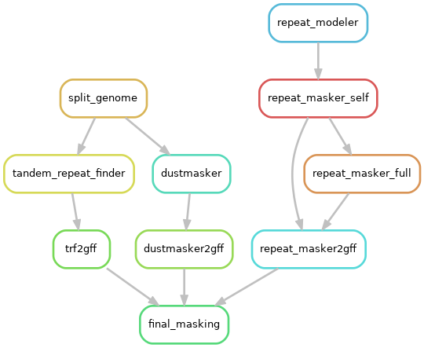
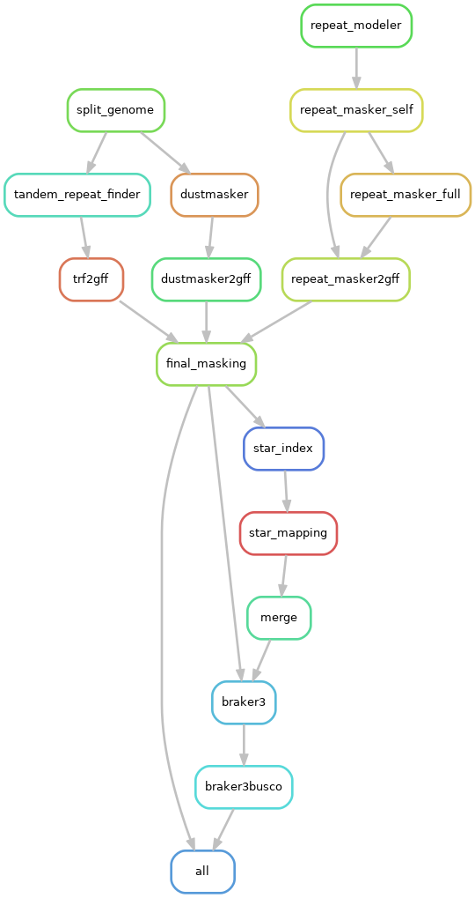
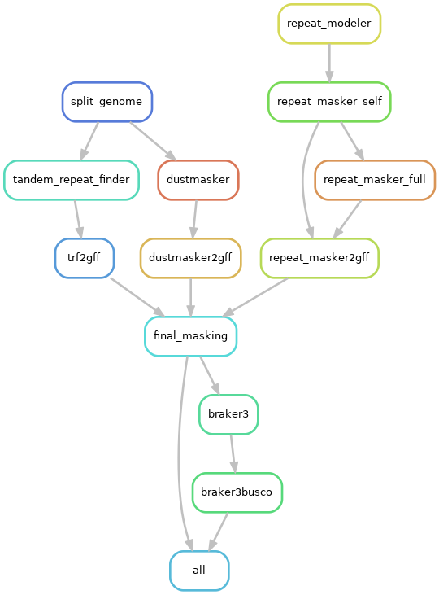

# **Genome Annotation Pipeline**

This is a repeat and gene annotation pipeline written in [snakemake](https://snakemake.readthedocs.io/en/stable/) that draws inspiration from the [genofish annotation pipeline](https://www.sigenae.org/project_support/Genofish.html), albeit with new capabilities, major modifications and without the use of MAKER. 
We originally designed it for the annotation of a *Phoxinus sp.* genome assembly. However, its versatility allows it to be applied to various vertebrate genomes and the output can be as sophisticated as your input databases.

The pipeline was designed with ease-of-use in mind and to allow the user to personalize the run as much as possible without the need for editing the code directly. All functionalities and customizations are manageable from the *`config/config.yaml`* file. 
Direct modifications to the makefiles should be reserved for instances of significant program installation discrepancies.  It has been tested on an SGE cluster, and users on SGE or different systems are encouraged to provide their feedback.

For repeat annotation, the pipeline employs RepeatModeler, RepeatMasker, Tandem Repeat Finder, and Dustmaker. Gene annotation is performed by BRAKER3.


Table of Contents
========
- [Input](#input)
- [Dependencies](#dependencies)
    - [Environments](#environments)
- [Functionalities](#functionalities)
- [Testing](#testing)
- [Running the Pipeline](#run-pipeline)
- [Pipeline Visualization](#pipeline-visualization)
- [References](#references-of-tools-used)
## Input

All inputs need to be specified in the *`config/config.yaml`* file.

- Absolute path to one haplotype at a time from a genome assembly.
- Folder path to paired-end RNA seq reads  *`"{sample_ID_per_read_pair}1.{ext}"`* and *`"{sample_ID_per_read_pair}2.{ext}"`*.
- Absolute path to a protein database as a `{filename}.fasta` file.
- Dfam curated species library name as a string or absolute path to your own curated repeat library. The pipeline can deal with either case.
- An augustus_custom_extrinsic.cfg files placed inside the `./utils` library and a gm_key for Genemark placed inside the user's home directory.

### RNA-seq and protein sequences for BRAKER3

If you don't have protein or RNA sequences for your sample or species, you can:

- download the latest UniProt db using:

```
wget ftp://ftp.uniprot.org/pub/databases/uniprot/current_release/knowledgebase/complete/uniprot_sprot.fasta.gz
gunzip uniprot_sprot.fasta.gz
```

- or download an OrthoDB dataset provided by BRAKER3 from [here](https://bioinf.uni-greifswald.de/bioinf/partitioned_odb11/index.html)

- if you don't have RNA-seq data you can look for them in:
https://trace.ncbi.nlm.nih.gov/Traces/sra/sra.cgi?view=software

and unpack them with:
```
fastq-dump --split-files path/to/YOUR_SRA
```

In case you don't have your own sequencing data, or your data is not sufficient, and you need to use either RNA or protein evidence input for BRAKER3, it is advized to curate your own datasets and avoid redundancy in the sequences as much as possible.

- Alternatively, BRAKER3 provides its own set of example data for running BRAKER3 in EP and ET modes which can be accessed from the [BRAKER github page](https://github.com/Gaius-Augustus/BRAKER/tree/master/example).

This pipeline allows you to run BRAKER3 with any datatype you have. For more, see the following [**Functionalities section**](#functionalities)

## Dependencies

The following packages need to be set up separately. They can be installed as per the instructions on their respective GitHub pages or in a manner suitable for your system. If your setup differs significantly, you may need to manually adjust the calls to these programs within their respective makefiles found under *'workflow/rules/'*:

In this pipeline, we utilize modules, which can be modified in the *`config/config.yaml`* file.

- [conda](https://docs.anaconda.com/free/anaconda/reference/release-notes/#anaconda-2022-05-may-10-2022)
- [Tandem Repeat Finder](https://github.com/Benson-Genomics-Lab/TRF)
- [STAR](https://github.com/alexdobin/STAR)
- [AUGUSTUS](http://augustus.gobics.de/)

### Containers

[RepeatModeler](https://github.com/Dfam-consortium/TETools), [RepeatMasker](https://hub.docker.com/r/pegi3s/repeat_masker/) and [BRAKER3](https://hub.docker.com/r/teambraker/braker3) are used as containers which we find worked best on our system. You can specify them in the "containers" section of the *`config/config.yaml`* file.

### BUSCO

For [BUSCO](https://busco.ezlab.org/), it's recommended to use it `offline`. Download your relevant lineage from [here](https://busco-data.ezlab.org/v5/data/lineages/), unpack and place in a folder:

```
curl -O <link>
tar -xf <file> # becomes <folder>
mkdir busco_downloads
mkdir busco_downloads/lineages
mv <folder> busco_downloads/lineages
```

Specify the path in the *`config/config.yaml`* file.

### Environment(s)

In order to run the pipeline, you need a basic conda environment with python>=3.9 and mamba on your system. 
You can create that with:

```
conda create -y -n genome_annotation "python>=3.9" "mamba>=0.22.1" -c conda-forge -c bioconda -c defaults
conda activate genome_annotation
```

You can then install the environments used by the different rules of the pipeline in a terminal with an internet connection:

```
#conda activate genome_annotation
snakemake --snakefile workflow/Snakefile.smk --cores 5 -p -r -w 5 --verbose --use-conda --conda-create-envs-only
```

This can take several minutes and needs to be done every time the environment files are changed.

Note: Before running the pipeline you need to have **singularity** activated on the node that will run the snakemake command.

## Functionalities

This pipeline allows the user to customize the run based on the input data.

- **ES**: If have neither RNA nor protein data, BRAKER3 will run in ES mode. You should set the `BRAKER3 mode` to `"ES"` in the *`config/config.yaml`*
- **ET**: If you only have a genome and RNA seq data, you need to set the mode to `"ET"`. See [Input](#input)
- **hints**: If you have a hints file, either `{filename}.hints` or `{filename}hints.gff` - like the data provided from BRAKER3, from a previous BRAKER3 run or from making the data yourself with a program like exonerate, HISAT2 and/or ProtHint, you need to set the mode to `"hints"`
- **EP**: If you only have a protein database saved as a fasta file, you need to set the mode to `"EP"`.
- **ETP**: Finally, if you have both a protein database and a set of RNA sequence data you need to set the mode to `"ETP"`. The RNA will be mapped to your genome with STAR and the output of that will be used for BRAKER3.

The user can additionally edit the options passed to BRAKER from the configuration file.

## Testing

To test if the pipeline can work in your system, you can download the example data provided by BRAKER3 from [here](https://github.com/Gaius-Augustus/BRAKER/tree/master/example)

Once you do, you can add these files as input in the *`config/config.yaml`* file like so:

```
genome:
    file: "path/to/genome.fa"
    haplotype: "hap1"

rnaseq:
    folder: "folder/to/rnaseq/"
    type: "Stranded"

prot_db: "path/to/my_proteins.fa"
```

## Test run:

```
snakemake -s workflow/Snakefile.smk --dry-run --cores 5 -p -r -w 5 --verbose
```

## Run pipeline:

The pipeline accepts one assembly fasta file at a time for better control of each run, resource management and to avoid overwriting temporary files.
The configuration `"HAP"` variable can be used as a proxy for the assembly prefix and the haplotype used for each run.

You can then run the pipeline with:

```
snakemake \
    --snakefile workflow/Snakefile.smk \
    --keep-going \
    --latency-wait 300 \
    -j ${THREADS} \
    --use-singularity \
    --singularity-args "--home $PWD" \
    --singularity-args "--bind $PWD/temp:/tmp" \
    --default-resources "tmpdir='/path/to/tmp'" \
    --verbose \
    --use-conda \
    --use-envmodules \
    --printshellcmds \
    --reason \
    --nolock \
    --rerun-triggers mtime \
    --rerun-incomplete \
    --stats "./stats.json" \
    --report "./report.html"
```

## Visualize the steps of the pipeline:

You can create a represenation of the pipeline with:
```
snakemake -s workflow/Snakefile.smk --dag --forceall | dot -Tpng > graph_of_jobs.png
snakemake -s workflow/Snakefile.smk --dag --until final_masking | dot -Tpng > workflow/graph_of_jobs_repeat_masking.png

snakemake -s workflow/Snakefile.smk --filegraph --forceall | dot -Tpng > filegraph_all.png

snakemake -s workflow/Snakefile.smk --rulegraph --forceall | dot -Tpng > workflow/rulegraph_all.png
snakemake -s workflow/Snakefile.smk --rulegraph --until final_masking | dot -Tpng > workflow/rulegraph_repeat_masking.png
```

---

### Repeat Masking



---

### Entire pipeline in ETP mode:

 

### Entire pipeline in EP mode:

 

---


# References of tools used

- BLAST
    - Altschul, A.F., Gish, W., Miller, W., Myers, E.W. and Lipman, D.J. (1990). A basic local alignment search tool. J Mol Biol 215:403--410.
    - Camacho, C., Coulouris, G., Avagyan, V., Ma, N., Papadopoulos, J., Bealer, K., and Madden, T.L. (2009). Blast+:architecture and applications. BMC bioinformatics, 10(1):421. 
- TRF 
    - Gary Benson, Tandem repeats finder: a program to analyze DNA sequences, Nucleic Acids Research, Volume 27, Issue 2, 1 January 1999, Pages 573–580, https://doi.org/10.1093/nar/27.2.573
- RepeatModeler
    - https://github.com/Dfam-consortium/RepeatModeler/tree/master
- RepeatMasker
    - Jurka J, Smit AFA. "Reference collections of human and rodent repetitive elements." URL: http://www.girinst.org/
- Dustmaker
    - https://www.ncbi.nlm.nih.gov/IEB/ToolBox/CPP_DOC/lxr/source/src/app/dustmasker/README
    - Altschul, A.F., Gish, W., Miller, W., Myers, E.W. and Lipman, D.J. (1990). A basic local alignment search tool. J Mol Biol 215:403--410.
    - Camacho, C., Coulouris, G., Avagyan, V., Ma, N., Papadopoulos, J., Bealer, K., and Madden, T.L. (2009). Blast+:architecture and applications. BMC bioinformatics, 10(1):421. 
- Bedtools
    - Quinlan, A. R. (2014). BEDTools: the Swiss‐army tool for genome feature analysis. Current protocols in bioinformatics, 47(1):11-12.
- STAR
    - Dobin A, Davis CA, Schlesinger F, Drenkow J, Zaleski C, Jha S, Batut P, Chaisson M, Gingeras TR. STAR: ultrafast universal RNA-seq aligner. Bioinformatics. 2013 Jan 1;29(1):15-21. doi: 10.1093/bioinformatics/bts635. Epub 2012 Oct 25. PMID: 23104886; PMCID: PMC3530905.
- BRAKER3
    -   Bruna, T., Hoff, K.J., Lomsadze, A., Stanke, M., & Borodovsky, M. (2021). BRAKER2: Automatic Eukaryotic Genome Annotation with GeneMark-EP+ and AUGUSTUS Supported by a Protein Database. NAR Genomics and Bioinformatics 3(1):lqaa108, doi: 10.1093/nargab/lqaa108.

    -   Hoff, K.J., Lomsadze, A., Borodovsky, M. and Stanke, M. (2019). Whole-Genome Annotation with BRAKER. Methods Mol Biol. 1962:65-95, doi: 10.1007/978-1-4939-9173-0_5.

    -   Hoff, K.J., Lange, S., Lomsadze, A., Borodovsky, M. and Stanke, M. (2016). BRAKER1: unsupervised RNA-Seq-based genome annotation with GeneMark-ET and AUGUSTUS. Bioinformatics, 32(5):767-769.

    -   Stanke, M., Diekhans, M., Baertsch, R. and Haussler, D. (2008). Using native and syntenically mapped cDNA alignments to improve de novo gene finding. Bioinformatics, doi: 10.1093/bioinformatics/btn013.

    -   Stanke. M., Schöffmann, O., Morgenstern, B. and Waack, S. (2006). Gene prediction in eukaryotes with a generalized hidden Markov model that uses hints from external sources. BMC Bioinformatics 7, 62.

